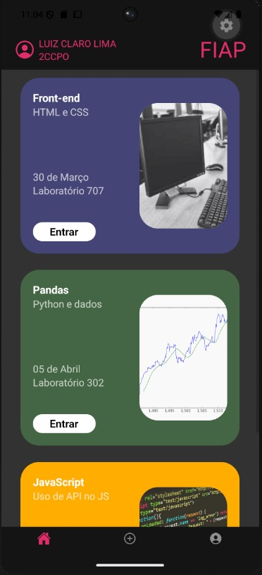
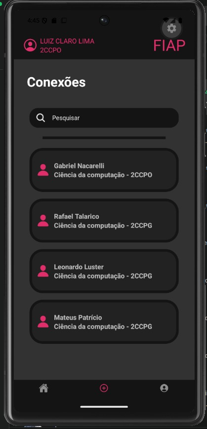
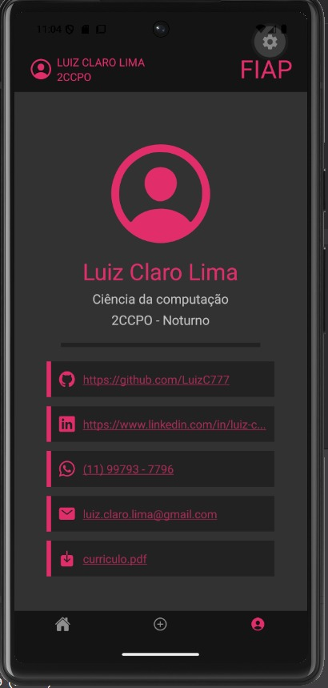

# 📱 Conecta FIAP

## 🎯 Sobre o Projeto

Este projeto é um MVP (Minimum Viable Product) desenvolvido em React Native para o Checkpoint 1 da disciplina de CPAD. 

**Problema Resolvido:**
A operação interna da FIAP escolhida para otimização foi a **gestão de disponibilidade e reserva de espaços físicos (laboratórios e salas de estudo)**. Atualmente, os alunos enfrentam atrito logístico para descobrir quais ambientes estão livres fora do horário de aula. 

O aplicativo atua como uma solução de alocação de recursos, permitindo que alunos criem e encontrem grupos de estudo já atrelados à disponibilidade real da infraestrutura da faculdade, reduzindo a ociosidade dos laboratórios e fomentando o networking acadêmico.

**Funcionalidades Implementadas:**
* **Feed de Grupos e Salas:** Visualização de grupos de estudo ativos com o respectivo laboratório/sala disponível para o horário.
* **Networking Acadêmico:** Sistema de busca e conexão entre alunos da instituição.
* **Perfil do Aluno:** Centralização de informações acadêmicas e links profissionais (GitHub, LinkedIn, Currículo).

## 👥 Integrantes do Grupo

* Luiz Claro Lima - RM563014
* Gabriel Nacarelli Pinheiro - RM565298

## 🚀 Como Rodar o Projeto

Para garantir a execução adequada do Conecta FIAP em seu ambiente local, siga o procedimento estruturado abaixo.

1. **Pré-requisitos do Ambiente:**
Certifique-se de ter o Node.js instalado em sua máquina. Além disso, é necessário ter o aplicativo Expo Go instalado em seu dispositivo físico (Android ou iOS) ou um emulador configurado (Android Studio / Xcode).

2. **Clonagem do Repositório:**
Abra o seu terminal e execute o comando de clonagem do Git utilizando a URL do repositório.
`git clone https://github.com/LuizC777/fiap-cpad-cp1-Conecta-FIAP.git`

3. **Instalação das Dependências:**
Acesse o diretório raiz do projeto recém-clonado através do terminal e execute a instalação dos pacotes necessários.
`cd fiap-cpad-cp1-Conecta-FIAP`
`npm install`

4. **Execução da Aplicação:**
Inicie o servidor de desenvolvimento do Expo.
`npx expo start`

5. **Acesso ao App:**
Após a inicialização, o terminal exibirá um QR Code. Escaneie este código utilizando o aplicativo Expo Go no seu smartphone ou pressione a tecla correspondente no terminal para abrir diretamente no emulador ativo.

## 📺 Demonstração

Esta seção apresenta o fluxo operacional do Conecta FIAP, validando a navegação funcional entre as três telas obrigatórias.

### Fluxo Principal em Funcionamento (GIF):

  

### Prints das Telas:

| Tela de Feed/Grupos | Tela de Conexões | Tela de Perfil |
| :---: | :---: | :---: |
|  |  |  |

*Nota: Os prints acima foram gerados diretamente do ambiente de desenvolvimento.*

## 🛠️ Próximos Passos (Diferenciais)

Considerando o escopo de MVP deste Checkpoint, as seguintes funcionalidades foram mapeadas para implementações futuras, visando aumentar a robustez da plataforma:

1.  **Integração Real:** Conexão com a API de horários da FIAP para validação automática da disponibilidade das salas em tempo real.
2.  **Sistema de Chat:** Implementação de chat WebSocket para permitir a comunicação instantânea entre os membros de um grupo de estudo.
3.  **Filtros Avançados:** Criação de filtros por curso, semestre e RM na tela de Conexões para facilitar o networking assertivo.
