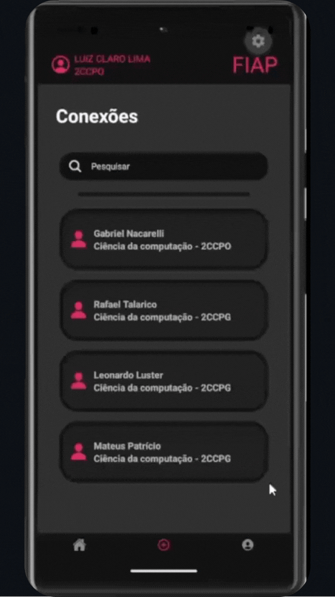

# 📱 Conecta FIAP

## 🎯 Sobre o Projeto

Este projeto é um MVP (Minimum Viable Product) desenvolvido em React Native para o Checkpoint 1 da disciplina de CPAD.

**Problema Resolvido:**
A operação interna da FIAP escolhida para otimização foi a **gestão de disponibilidade e reserva de espaços físicos (laboratórios e salas de estudo)**. Atualmente, os alunos enfrentam atrito logístico para descobrir quais ambientes estão livres fora do horário de aula.

O aplicativo atua como uma solução de alocação de recursos, permitindo que alunos criem e encontrem grupos de estudo já atrelados à disponibilidade real da infraestrutura da faculdade, reduzindo a ociosidade dos laboratórios e fomentando o networking acadêmico.

**Funcionalidades Implementadas:**

- **Feed de Grupos e Salas:** Visualização de grupos de estudo ativos com o respectivo laboratório/sala disponível para o horário.
- **Networking Acadêmico:** Sistema de busca e conexão entre alunos da instituição.
- **Perfil do Aluno:** Centralização de informações acadêmicas e links profissionais (GitHub, LinkedIn, Currículo).

## 👥 Integrantes do Grupo

- Luiz Claro Lima - RM563014
- Gabriel Nacarelli Pinheiro - RM565298

## 🚀 Como Rodar o Projeto

Para garantir a execução adequada do Conecta FIAP em seu ambiente local, siga o procedimento estruturado abaixo.

1. **Pré-requisitos do Ambiente:**
   Certifique-se de ter o Node.js instalado em sua máquina. Além disso, é necessário ter o aplicativo Expo Go instalado em seu dispositivo físico (Android ou iOS) ou um emulador configurado (Android Studio / Xcode).

2. **Clonagem do Repositório:**
   Abra o seu terminal e execute o comando de clonagem do Git utilizando a URL do repositório.
   `git clone https://github.com/LuizC777/fiap-cpad-cp1-Conecta-FIAP.git`

3. **Instalação das Dependências:**
   Acesse o diretório raiz do projeto recém-clonado através do terminal e execute a instalação dos pacotes necessários.
   `cd fiap-cpad-cp1-Conecta-FIAP`
   `npm install`

4. **Execução da Aplicação:**
   Inicie o servidor de desenvolvimento do Expo.
   `npx expo start`

5. **Acesso ao App:**
   Após a inicialização, o terminal exibirá um QR Code. Escaneie este código utilizando o aplicativo Expo Go no seu smartphone ou pressione a tecla correspondente no terminal para abrir diretamente no emulador ativo.

## 📺 Demonstração das Telas

### 1. Tela de Feed/Grupos (Home)

**Descrição:** Esta é a interface principal do aplicativo. Nela, o aluno pode visualizar os grupos de estudo disponíveis, conferir informações detalhadas (disciplina, data e laboratório) e interagir com o botão de estado dinâmico para confirmar sua entrada na sessão.

---

### 2. Tela de Conexões

**Descrição:** Focada no networking acadêmico, esta tela apresenta uma lista de alunos e seus respectivos cursos. Há uma barra de pesquisa utilizando `TextInput`, que permite escrever, mas ainda não há funcionalidade de busca.

---

### 3. Tela de Perfil

**Descrição:** Interface de apresentação do usuário logado. Exibe dados institucionais (curso e turno) e conta com links de contato funcionais. A integração com APIs nativas permite que o clique redirecione o usuário diretamente para aplicativos externos, como WhatsApp, LinkedIn, GitHub e cliente de E-mail.

## 🏗️ Decisões Técnicas

A arquitetura do aplicativo foi fundamentada na modularização de componentes e na gestão de estados locais, cumprindo rigorosamente os requisitos técnicos do Checkpoint.

1. **Estrutura e Componentização:** A interface foi construída utilizando os componentes core do React Native (`View`, `Text`, `Image`, `ScrollView`, `TouchableOpacity`). A estilização foi isolada no final de cada arquivo via `StyleSheet`, garantindo performance na renderização e mantendo a identidade visual da instituição (com o uso de cores hexadecimais padronizadas, como o `#E1306C`).

2. **Navegação (Expo Router):** O roteamento foi implementado através do componente `Tabs` no arquivo `_layout.js`. Essa decisão arquitetônica garante uma navegação persistente no rodapé da aplicação, evitando o recarregamento de telas (através do uso otimizado do método `router.navigate` em detrimento do `router.push` para transições de abas).

3. **Gerenciamento de Estado (Hooks):** O controle de interatividade, como a alternância visual e textual dos botões de inscrição nos grupos de estudo ("Entrar" / "Entrou"), foi implementado estritamente através do hook `useState`. O controle de estado individual para cada card de sessão garante reatividade imediata na interface do usuário.

## 🛠️ Próximos Passos

Considerando o escopo de MVP deste Checkpoint, as seguintes funcionalidades foram mapeadas para implementações futuras, visando aumentar a robustez da plataforma:

1.  **Integração Real:** Conexão com a API de horários da FIAP para validação automática da disponibilidade das salas em tempo real.
2.  **Sistema de Chat:** Implementação de chat WebSocket para permitir a comunicação instantânea entre os membros de um grupo de estudo.
3.  **Filtros Avançados:** Criação de filtros por curso, semestre e RM na tela de Conexões para facilitar o networking assertivo.
4.  **Barra de Pesquisa:** Torná-la totalmente funcional, utilizando efeitos colaterais para filtrar os contatos dinamicamente em tempo real enquanto o usuário digita.
